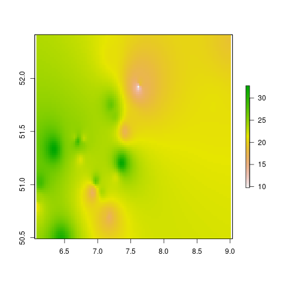

<!-- README.md is generated from README.Rmd. Please edit that file -->

```{r, include = FALSE}
knitr::opts_chunk$set(
  collapse = TRUE,
  comment = "#>"
)
```

# AQPrediction

<!-- badges: start -->
<!-- badges: end -->

The goal of this repo is to demonstrate spatio-temporal prediction models to estimate levels of air pollution.

The input dataset is an Excel [file](https://drive.google.com/open?id=14GvlMCBLR9FQ_BsCeg0tj-pb1AadXr3G3gKPnrfm8gg) provided as part of the [OpenGeoHub Summer School 2019](https://opengeohub.org/summer_school_2019).

We'll use these packages

```{r}
suppressPackageStartupMessages({
  library(dplyr)
  library(sf)
  library(ranger)
  library (CAST)
  library(caret)
  library(tmap)
  library(lubridate)
})
tmap_mode("view")
```

And read-in the input data as follows

```{r, warning=FALSE, message=FALSE}
piggyback::pb_upload("SpatialPrediction.xlsx")
train = readxl::read_excel("SpatialPrediction.xlsx", sheet = 1)
covar = readxl::read_excel("SpatialPrediction.xlsx", sheet = 2)
locat = readxl::read_excel("SpatialPrediction.xlsx", sheet = 3)
# times = readxl::read_excel("SpatialPrediction.xlsx", sheet = 4) # what is this? -->Their test set. They will use to check our model
targt = readxl::read_excel("SpatialPrediction.xlsx", sheet = 5)
# keep only useful vars
targt = targt %>% select(id, time) %>% 
  na.omit()
tail(targt)
wind = readRDS ("ERA5_24h_uvWind_precip.RDS") ## CHECK if the path is correct.
```

The objective is to fill the NA values in the `targt` data:

```{r}
targt
```

Let's do some data cleaning and plot the data:

```{r}
d = inner_join(train, covar)
d = inner_join(d, locat)
# d = merge(d, wind, by.x=c("id", "time"), by.y=c("monitors.id", "date")) ### inner_join to join using two columns????
wind_renamed = wind %>% 
  rename(id = monitors.id, time = date)
d = left_join(d, wind_renamed)
class(d$time)
d$dow  <- weekdays.POSIXt(d$time) # I included in the wind file
d$hour <- hour(d$time) # I included in the wind file
head(d); nrow(d)


# dsf = sf::st_as_sf(d, coords = c("X", "Y"), crs = 4326) # ducplicated geometries
locat_sf = st_as_sf(locat, coords = c("X", "Y"), crs = 4326)
summary(locat_sf)
mapview::mapview(locat_sf)
```

## Exploratory anaysis

How many points in the target are in the training data?

```{r}
nrow(locat)
length(unique(d$id))
length(unique(targt$id))
summary(targt$id %in% d$id)
targt_locat = inner_join(targt, locat)
targt_joined = left_join(targt_locat, covar)
targt_joined = left_join(targt_joined, wind_renamed)
targt_sf = st_as_sf(targt_joined, coords = c("X", "Y"))

nrow(locat_sf)
locat_sf$is_target = locat_sf$id %in% targt$id
tm_shape(locat_sf) + tm_dots("is_target") + tm_scale_bar()
locat_sf_training = locat_sf %>% filter(!is_target)
locat_sf_targt = locat_sf %>% filter(is_target)

# identify points in close proximity in training dataset
d_distance_matrix = st_distance(locat_sf_training)
d_distance_matrix = apply(d_distance_matrix, 1, as.numeric)
summary(d_distance_matrix[1, ])
d_distance_matrix[d_distance_matrix == 0] = NA
mins1 = apply(d_distance_matrix, 1, min, na.rm = TRUE)
which_mins1 = apply(d_distance_matrix, 1, which.min)
ids_min = locat_sf_training$id[which_mins1]
# d_nearest_training = st_nearest_feature(locat_sf_training, locat_sf_training)


# test it with random point: 5
nearest_to_5 = locat_sf_training %>% filter(id == ids_min[9])
nearest_to_5_and_5 = rbind(locat_sf_training[5, ], nearest_to_5)
tm_shape(nearest_to_5_and_5) + tm_dots() +
  tm_shape(locat_sf_training) + tm_dots(col = "red") +
  tm_shape(nearest_to_5_and_5) + tm_dots() 

mins_training_target = st_distance(locat_sf_training)
min1_1 = which.min(mins1)
# which.min(d_distance_matrix)

min1_2 = which.min(d_distance_matrix[min1_1, ])
locat_sf_training_min1 = locat_sf_training %>% 
  slice(c(min1_1, min1_2))
mapview::mapview(locat_sf_training_min1)

# check similarity
d_pair1 = d %>% 
  filter(id %in% locat_sf_training_min1$id)

d_pair1 %>% 
  ggplot() +
  geom_line(aes(time, PM10, col = id)) # omg they are the same!

d %>% 
  filter(id %in% locat$id[1:9]) %>% 
  ggplot() +
  geom_line(aes(time, PM10, col = id)) # omg they are the same!


# cor(d_pair1$PM10[d_pair1$id == locat_sf_training_min1$id[1]],
#     d_pair1$PM10[d_pair1$id == locat_sf_training_min1$id[2]]) 

# work out how to predict from the nearest...

# get distance to nearest for all training data
locat_sf_training$distance_to_nearest = mins1
# inner_join(d, locat_sf_training)
locat_sf_training$id_nearest = NA
i = 1
for(i in 1:nrow(locat_sf_training)) {
  nearest_point = min(d_distance_matrix[i, ], na.rm = TRUE)
  index_nearest = which(d_distance_matrix[, i] == nearest_point)
  locat_sf_training$id_nearest[i] = locat_sf_training$id[index_nearest]
}
locat_sf_training %>% select(id, id_nearest)

# check on random numbers
n = 26
mapview::mapview(rbind(
  locat_sf_training %>% slice(n),
  locat_sf_training %>% filter(id == locat_sf_training$id_nearest[n])
))

# now calculate distance for target
d_distance_matrix = st_distance(locat_sf_targt, locat_sf_training)
d_distance_matrix = apply(d_distance_matrix, 1, as.numeric)
summary(d_distance_matrix[1, ])
d_distance_matrix[d_distance_matrix == 0] = NA
mins1 = apply(d_distance_matrix, 2, min, na.rm = TRUE)
summary(mins1)
length(mins1) == nrow(locat_sf_targt)
locat_sf_targt$distance_to_nearest = mins1

dim(d_distance_matrix)
i = 1
locat_sf_targt$id_nearest = NA
for(i in 1:nrow(locat_sf_targt)) {
  nearest_point = min(d_distance_matrix[, i], na.rm = TRUE)
  index_nearest = which(d_distance_matrix[, i] == nearest_point)
  locat_sf_targt$id_nearest[i] = locat_sf_training$id[index_nearest]
}

n = 2
nearest_to_test = locat_sf_training %>% 
  filter(id == locat_sf_targt$id_nearest[n])
mapview::mapview(rbind(
  locat_sf_targt %>% slice(n),
  nearest_to_test
))


# timeseries tests
summary(targt$time %in% d$time)
names(locat_sf_targt)

# joining distance + id to training + target vars
names(d)
d_np = inner_join(d, locat_sf_training)
targt_np = targt_sf %>% st_drop_geometry() %>% 
  inner_join(., locat_sf_targt)

i = 5
# get prediction for all times in test
test_training1 = d_np %>% slice(n)
training_nearest = d_np %>% filter(id == test_training1$id_nearest[i])
plot(test_training1$time, test_training1$PM10, type = "line", ylim = c(0, 99))
points(training_nearest$time, training_nearest$PM10)
test_training1_joined = inner_join(
  test_training1,
  training_nearest %>% select(time, PM10_nearest = PM10),
  
)
summary(test_training1_joined$PM10_nearest)
test_training1_joined$PM10_nearest = imputeTS::na_interpolation(x = test_training1_joined$PM10_nearest)

plot(test_training1$time, test_training1$PM10, type = "line", ylim = c(0, 99))
points(test_training1_joined$time, test_training1_joined$PM10_nearest)

# For loop to find nearest
d_np$PM10_nearest = NA
ids_training = unique(unique(d_np$id))
i = ids_training[22]
for(i in ids_training) {
  test_training1 = d_np %>% filter(id == i)
  training_nearest = d_np %>% filter(id == test_training1$id_nearest[1])
  test_training1_joined = left_join(
  test_training1,
  training_nearest %>% select(time, PM10_n = PM10)
  )
  if(sum(!is.na(test_training1_joined$PM10_n)) > 2 ){
      test_training1_joined$PM10_nearest = imputeTS::na_interpolation(x = test_training1_joined$PM10_n)

  d_np$PM10_nearest[d_np$id == i] = test_training1_joined$PM10_nearest 
  
  plot(d_np$time[d_np$id == i], d_np$PM10[d_np$id == i], type = "line")
  points(d_np$time[d_np$id == i], d_np$PM10_nearest[d_np$id == i])
  } else {
    message("Skipping id", i)
  }

}

# View(d_np)
cor(d_np$PM10, d_np$PM10_nearest, use = "complete.obs")
saveRDS(d_np, "d_np.Rds")
piggyback::pb_upload("d_np.Rds")

# For loop to find nearest in target
targt_np$PM10_nearest = NA
ids_training = unique(unique(targt_np$id))
i = ids_training[22]
for(i in ids_training) {
  test_training1 = targt_np %>% filter(id == i)
  training_nearest = d_np %>% filter(id == test_training1$id_nearest[1])
  test_training1_joined = left_join(
  test_training1,
  training_nearest %>% select(time, PM10_n = PM10)
  )
  if(sum(!is.na(test_training1_joined$PM10_n)) > 2 ){
      test_training1_joined$PM10_nearest = imputeTS::na_interpolation(x = test_training1_joined$PM10_n)

  targt_np$PM10_nearest[targt_np$id == i] = test_training1_joined$PM10_nearest 
  
  plot(targt_np$time[targt_np$id == i], targt_np$PM10_nearest[targt_np$id == i])
  } else {
    message("Skipping id", i)
  }

}
saveRDS(targt_np, "targt_np.Rds")
piggyback::pb_upload("targt_np.Rds")
```


```{r}
## FORMULA ##
formula = as.formula(PM10 ~  humidity + temperature + (X*Y) + u10 + v10 + tp + dow + hour)
```


A simple model:

```{r}
##\\LINEAR//##
m = lm(formula, data = d)
## Are all the predictors significant? Let's check!
summary(m)

lm.df = d
lm.df$pred = predict(m, newdata = lm.df)
lm.random = lm(PM10 ~ pred, data=lm.df)
summary(lm.random)
plot(lm.df$PM10, lm.df$pred)
cor(lm.df$PM10, lm.df$pred)^2
```
A simple linear model can explain ~19% of the variability in PM10 levels, not great!


## Add roads

```{r}
bb = st_bbox(locat_sf)

```

See www.osm.org for major roads

```{r, eval=FALSE}
# library(osmdata)
# osm_data = opq(bbox = bb) %>% 
#   add_osm_feature(key = "highway", value = "motorway") %>% 
#   osmdata_sf()
download.file("http://download.geofabrik.de/europe/germany/nordrhein-westfalen-latest-free.shp.zip", "roads.zip")
unzip("roads.zip")
# osm_westfalen_traffic = sf::read_sf("gis_osm_traffic_a_free_1.shp")
osm_westfalen_transport = sf::read_sf("gis_osm_roads_free_1.shp")
osm_westfalen_transport
mapview::mapview(osm_westfalen[1:999, ])
saveRDS(osm_westfalen_transport, "roads-all.Rds")
table(osm_westfalen_transport$fclass)
roads_big = osm_westfalen_transport %>% 
  filter(grepl(pattern = "motorway|primary|trunk|second|resi", fclass))
mapview::mapview(roads_big %>% sample_n(100)) +
  mapview::mapview(locat_sf)
saveRDS(roads_big, "roads_big.Rds")
```

```{r}
roads_big = readRDS("roads_big.Rds")
table(roads_big$fclass)
roads_big_class = roads_big %>% 
  mutate(class = case_when(
    grepl(pattern = "moto", fclass) ~ 4,
    grepl(pattern = "prim", fclass) ~ 3,
    grepl(pattern = "trunk", fclass) ~ 2,
    grepl(pattern = "sec", fclass) ~ 1,
    grepl(pattern = "resi", fclass) ~ 0,
    )) %>% 
  select(class, maxspeed)
tm_shape(roads_big_class[1:999, ]) + tm_lines("class") 
```

Add to point training data

```{r, eval=FALSE}
names(d)
d_buff = stplanr::geo_projected(locat_sf, sf::st_buffer, dist = 500) # note to robin: fix!
plot(d_buff[1:5, ])
# roads_in_500m = st_intersection(roads_big_class, d_buff)
# saveRDS(roads_in_500m, "roads_in_500m.Rds")
roads_in_500m = readRDS("roads_in_500m.Rds")
mapview::mapview(d_buff) +
  mapview::mapview(roads_in_500m %>% sample_n(500))
d_roads = st_join(d_buff, roads_in_500m %>% select(-id))
d_roads
d_roads_agg = d_roads %>% 
  st_drop_geometry() %>% 
  group_by(id) %>% 
  summarise(
    mean_speed = mean(maxspeed),
    n_roads_4 = sum(class == 4),
    n_roads_3 = sum(class == 3),
    n_roads_2 = sum(class == 2),
    n_roads_1 = sum(class == 1),
    n_roads_0 = sum(class == 0),
    )
summary(d_roads_agg)
nrow(d_roads_agg) == nrow(locat)
locat_roads = inner_join(locat_sf, d_roads_agg)
summary(locat_roads)

st_crs(locat_roads) = 4326
tm_shape(locat_roads) + tm_dots(col = "n_roads_4")
tm_shape(locat_roads) + tm_dots(col = "n_roads_0")
tm_shape(locat_roads) + tm_dots(col = "mean_speed")
summary(locat_roads)
locat_roads_df = locat_roads %>% st_drop_geometry()
locat_roads_no_nas = locat_roads_df %>% 
  mutate_at(vars(matches("road|mean_s")), .funs = ~tidyr::replace_na(., 0))

summary(locat_roads_no_nas)

mapview::mapview(locat_roads)
length(unique(d))

nrow(targt)
nrow(targt_np)

targt_npr = left_join(targt_np, locat_roads_no_nas)
d_npr = left_join(d_np, locat_roads_no_nas)
d_npr = na.omit(d_npr)

summary(d_npr$mean_speed)
summary(d_npr$PM10_nearest)
summary(targt_npr$PM10_nearest)
cor(d_npr$n_roads_0, d_npr$PM10, use = "complete.obs")
cor(d_npr$n_roads_1, d_npr$PM10, use = "complete.obs")
cor(d_npr$n_roads_2, d_npr$PM10, use = "complete.obs")
cor(d_npr$n_roads_3, d_npr$PM10, use = "complete.obs")
cor(d_npr$n_roads_4, d_npr$PM10, use = "complete.obs")


names(d_npr)

# add xy
targt_xy = locat %>% 
  select(id, X, Y) 
# %>% 
#   mutate(XY)
targt_npr = left_join(targt_npr, targt_xy)

summary(targt_npr)

saveRDS(d_npr, "d_npr.Rds")
saveRDS(targt_npr, "targt_npr.Rds")
piggyback::pb_upload("d_npr.Rds")
piggyback::pb_upload("targt_npr.Rds")
```

## Training

Start with a linear model:


```{r}
## FORMULA ##
formula = as.formula(PM10 ~  humidity + temperature + (X*Y) + u10 + v10 + tp + dow + hour +
                       + distance_to_nearest + PM10_nearest + mean_speed +
                       n_roads_4 + n_roads_3 + n_roads_2 + n_roads_1 + n_roads_0)
```


A simple model:

```{r, eval=FALSE}
d = d_npr
summary(d)
names(d)

##\\LINEAR//##
m = lm(formula, data = d)
## Are all the predictors significant? Let's check!
summary(m)

lm.df = d
lm.df$pred = predict(m, newdata = lm.df)
lm.random = lm(PM10 ~ pred, data=lm.df)
summary(lm.random)
plot(lm.df$PM10, lm.df$pred)
cor(lm.df$PM10, lm.df$pred)^2
```


Lets try a fancy model: Random Forest

```{r, eval=FALSE}
##\\RANDOM FOREST//##

tunegrid = expand.grid(.mtry=c(6), .splitrule = "variance", .min.node.size = c(5))

#@ mtry = 3 (Number of variables to possibly split at in each node. Default is the (rounded down) square root of the number variables).
#@ min.node.size = 5  (Minimal node size. Default 1 for classification, 5 for regression, 3 for survival, and 10 for probability).
#@ splitrule = variance (Splitting rule. For regression "variance", "extratrees" or "maxstat" with default "variance").

## CV TYPE RANDOM
ranger.model = caret::train (formula, 
                                data= d, 
                                method="ranger", 
                                metric="RMSE",
                                num.trees = 50,
                                tuneGrid=tunegrid, 
                                trControl=trainControl(method="cv", number=10, 
                                                      allowParallel=TRUE))  
ranger.model
#  RMSE     Rsquared  MAE     
#5.989361  0.882534  3.577604

## CV TYPE SPACE
space.cv = CreateSpacetimeFolds(d, spacevar = "id", k = 10)
  
ranger.space = caret::train (formula, 
                                data= d, 
                                method="ranger", 
                                metric="RMSE",
                                num.trees = 50,
                                tuneGrid=tunegrid,
                                trControl=trainControl(method="cv", index = space.cv$index,
                                                      allowParallel = TRUE))

ranger.space 
#  RMSE     Rsquared   MAE     
#11.58011  0.5467433  7.581717

space.df = d
space.df$pred = predict(ranger.space, space.df)
lm.space = lm(PM10 ~ pred, data=space.df)
summary(lm.space)


##CV TYPE TIME
time.cv = CreateSpacetimeFolds(d, spacevar = "time", k = 10)
  
ranger.time = caret::train (formula, 
                                data= d, 
                                method="ranger", 
                                metric="RMSE",
                                num.trees = 50,
                                tuneGrid=tunegrid,
                                trControl=trainControl(method="cv", index = time.cv$index,
                                                      allowParallel = TRUE))
                                                      
ranger.time
#  RMSE      Rsquared   MAE     
# 6.277938  0.8732086  3.874261

time.df = d
time.df$pred = predict(ranger.time, time.df)
lm.time = lm(PM10 ~ pred, data=time.df)
summary(lm.time)

## CV TYPE SPACE-TIME 
spacetime.cv = CreateSpacetimeFolds(d, spacevar = "id",timevar ="time", k = 10)
  
ranger.spacetime = caret::train (formula, 
                                data= d, 
                                method="ranger", 
                                metric="RMSE",
                                num.trees = 50,
                                tuneGrid=tunegrid,
                                trControl=trainControl(method="cv", index = spacetime.cv$index,
                                                      allowParallel = TRUE))
                                                      
ranger.spacetime
#  RMSE      Rsquared   MAE     
# 9.591133  0.6802324  5.760715

spacetime.df = d
spacetime.df$pred = predict(ranger.spacetime, spacetime.df)
lm.spacetime = lm(PM10 ~ pred, data=spacetime.df)
summary(lm.spacetime)
```

To get the result let's see what is in the target table:

```{r, eval=FALSE}
# targt_joined = inner_join(targt, locat)
# targt_joined = inner_join(targt_joined, covar)
# targt_joined = merge(targt_joined, wind, by.x=c("id", "time"), by.y=c("monitors.id", "date")) ## inner_join to join using two columns????
targt_joined = targt_npr

summary(targt_joined)
summary(targt$id %in% d$id)
summary(targt$id %in% covar$id)
summary(targt$id %in% locat$id)
summary(targt$id %in% wind$monitors.id)
```


## Prediction


Now we can predict the missing values:

```{r, eval=FALSE}
names(d)

summary(targt_npr)

targt_npr_no_na = targt_npr %>% 
  mutate_at(vars(matches("tp|ho|v|u|era")), .funs = ~tidyr::replace_na(., mean(.)))

targt_no_na = targt_npr %>% na.omit()


p = predict(ranger.model, newdata = targt_npr_no_na)
summary(p)
targt_no_na$p = p

targt_min1 = targt_npr %>% select(id, time)
targt_min2 = targt_no_na %>% select(id, time, p)
targt_final = left_join(targt_min1, targt_min2)
summary(targt_final$p)
summary(unique(targt_final$id))
nrow(targt_final)

write.csv(targt_final, "p.csv")
length(p)
piggyback::pb_upload("p.csv")

# testing
targt_final = readr::read_csv("p.csv")
res_sf = targt_final %>% 
  group_by(id) %>% 
  summarise(PM10 = mean(p, na.rm = T))
res_sf = inner_join(res_sf, locat) %>% 
  st_as_sf(coords = c("X", "Y"))

library(raster)
library(gstat)
ras = raster::raster(x = res_sf, ncols = 100, nrows = 100)


g = gstat(formula = PM10 ~ 1, locations = res_sf)
r_idw = raster::interpolate(ras, g)
png("ras.png")
plot(r_idw)
dev.off()
```



```{r, echo=FALSE}
# system.time(x = 1:1e9)
# system.time({x = 1:1e9})
```

