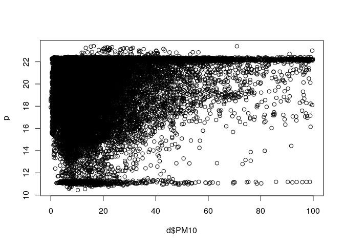

<!-- README.md is generated from README.Rmd. Please edit that file -->

# AQPrediction

<!-- badges: start -->

<!-- badges: end -->

The goal of this repo is to demonstrate spatio-temporal prediction
models to estimate levels of air pollution.

The input dataset is an Excel
[file](https://drive.google.com/open?id=14GvlMCBLR9FQ_BsCeg0tj-pb1AadXr3G3gKPnrfm8gg)
provided as part of the [OpenGeoHub Summer
School 2019](https://opengeohub.org/summer_school_2019).

We’ll use these packages

``` r
suppressPackageStartupMessages({
  library(dplyr)
  library(sf)
  library(ranger)
  library (CAST)
  library(caret)
})
```

And read-in the input data as follows

``` r
train = readxl::read_excel("SpatialPrediction.xlsx", sheet = 1)
covar = readxl::read_excel("SpatialPrediction.xlsx", sheet = 2)
locat = readxl::read_excel("SpatialPrediction.xlsx", sheet = 3)
# times = readxl::read_excel("SpatialPrediction.xlsx", sheet = 4) # what is this? -->Their test set. They will use to check our model
targt = readxl::read_excel("SpatialPrediction.xlsx", sheet = 5)
```

The objective is to fill the NA values in the `targt` data:

``` r
targt[1:3]
#> # A tibble: 5,004 x 3
#>    id                       time                PM10 
#>    <chr>                    <dttm>              <lgl>
#>  1 5a5da3c80aa2a900127f895a 2019-04-06 18:00:00 NA   
#>  2 590752d15ba9e500112b21db 2019-04-09 06:00:00 NA   
#>  3 5a58cb80999d43001b7c4ecb 2019-04-03 22:00:00 NA   
#>  4 5a5da3c80aa2a900127f895a 2019-04-03 00:00:00 NA   
#>  5 5a636a22411a790019bdcafd 2019-04-07 10:00:00 NA   
#>  6 5c49b10c35acab0019e6ce19 2019-04-03 16:00:00 NA   
#>  7 5a1b3c7d19991f0011b83054 2019-04-14 04:00:00 NA   
#>  8 5c57147435809500190ef1fd 2019-04-06 12:00:00 NA   
#>  9 5978e8fbfe1c74001199fa2a 2019-04-06 07:00:00 NA   
#> 10 5909d039dd09cc001199a6bf 2019-04-09 15:00:00 NA   
#> # … with 4,994 more rows
```

Let’s do some data cleaning and plot the data:

``` r
d = inner_join(train, covar)
#> Joining, by = c("id", "time")
d = inner_join(d, locat)
#> Joining, by = "id"

class(d$time)
#> [1] "POSIXct" "POSIXt"
d$dow <- weekdays.POSIXt(d$time)
# d$hour <-  ??? (d$time) # do you remember how to extract the hour??
head(d)
#> # A tibble: 6 x 8
#>   id       time                 PM10 humidity temperature     X     Y dow  
#>   <chr>    <dttm>              <dbl>    <dbl>       <dbl> <dbl> <dbl> <chr>
#> 1 581dab8… 2019-04-01 00:00:00  4.16     64.4        2.1   6.46  51.8 Mond…
#> 2 581dab8… 2019-04-01 01:00:00  4.99     64.7        1.65  6.46  51.8 Mond…
#> 3 581dab8… 2019-04-01 02:00:00  4.88     65.1        1.15  6.46  51.8 Mond…
#> 4 581dab8… 2019-04-01 03:00:00  6.68     65.3        0.7   6.46  51.8 Mond…
#> 5 581dab8… 2019-04-01 04:00:00  5.4      65.6        0.4   6.46  51.8 Mond…
#> 6 581dab8… 2019-04-01 05:00:00  6.57     67.6        0.3   6.46  51.8 Mond…
nrow(d)
#> [1] 23719

dsf = sf::st_as_sf(d, coords = c("X", "Y"), crs = 4326)
summary(dsf)
#>       id                 time                          PM10      
#>  Length:23719       Min.   :2019-04-01 00:00:00   Min.   : 0.00  
#>  Class :character   1st Qu.:2019-04-03 21:00:00   1st Qu.: 8.75  
#>  Mode  :character   Median :2019-04-06 19:00:00   Median :14.97  
#>                     Mean   :2019-04-07 12:57:52   Mean   :19.78  
#>                     3rd Qu.:2019-04-11 07:00:00   3rd Qu.:25.25  
#>                     Max.   :2019-04-14 23:00:00   Max.   :99.87  
#>     humidity       temperature           dow           
#>  Min.   :  0.00   Min.   :-140.760   Length:23719      
#>  1st Qu.: 60.70   1st Qu.:   6.480   Class :character  
#>  Median : 87.65   Median :   9.100   Mode  :character  
#>  Mean   : 77.98   Mean   :   8.051                     
#>  3rd Qu.: 99.90   3rd Qu.:  12.688                     
#>  Max.   :100.00   Max.   :  50.000                     
#>           geometry    
#>  POINT        :23719  
#>  epsg:4326    :    0  
#>  +proj=long...:    0  
#>                       
#>                       
#> 
mapview::mapview(dsf %>% sample_n(1000))
```

<!-- -->

Lat and long are also predictors, but work as an interaction X\*Y We can
check if day of the week, just day or hour are valuable predictors, but
working as.factor(day) in the regression.

Lets try a fancy model. Random Forest

``` r
################
## FORMULA ##
formula <- as.formula(PM10 ~ humidity + temperature + (X*Y))

#####################
##\\RANDOM FOREST//##
#####################
tunegrid <- expand.grid(.mtry=c(3), .splitrule = "variance", .min.node.size = c(5))
#@ mtry = 3 (Number of variables to possibly split at in each node. Default is the (rounded down) square root of the number variables).
#@ min.node.size = 5  (Minimal node size. Default 1 for classification, 5 for regression, 3 for survival, and 10 for probability).
#@ splitrule = variance (Splitting rule. For regression "variance", "extratrees" or "maxstat" with default "variance").

#RANDOM CV
ranger.model <- caret::train (formula, 
                                data= d, 
                                method="ranger", 
                                metric="RMSE",
                                num.trees = 50,
                                tuneGrid=tunegrid, 
                                trControl=trainControl(method="cv", number=10, 
                                                      allowParallel=TRUE, verboseIter=TRUE))  
#> + Fold01: mtry=3, splitrule=variance, min.node.size=5 
#> - Fold01: mtry=3, splitrule=variance, min.node.size=5 
#> + Fold02: mtry=3, splitrule=variance, min.node.size=5 
#> - Fold02: mtry=3, splitrule=variance, min.node.size=5 
#> + Fold03: mtry=3, splitrule=variance, min.node.size=5 
#> - Fold03: mtry=3, splitrule=variance, min.node.size=5 
#> + Fold04: mtry=3, splitrule=variance, min.node.size=5 
#> - Fold04: mtry=3, splitrule=variance, min.node.size=5 
#> + Fold05: mtry=3, splitrule=variance, min.node.size=5 
#> - Fold05: mtry=3, splitrule=variance, min.node.size=5 
#> + Fold06: mtry=3, splitrule=variance, min.node.size=5 
#> - Fold06: mtry=3, splitrule=variance, min.node.size=5 
#> + Fold07: mtry=3, splitrule=variance, min.node.size=5 
#> - Fold07: mtry=3, splitrule=variance, min.node.size=5 
#> + Fold08: mtry=3, splitrule=variance, min.node.size=5 
#> - Fold08: mtry=3, splitrule=variance, min.node.size=5 
#> + Fold09: mtry=3, splitrule=variance, min.node.size=5 
#> - Fold09: mtry=3, splitrule=variance, min.node.size=5 
#> + Fold10: mtry=3, splitrule=variance, min.node.size=5 
#> - Fold10: mtry=3, splitrule=variance, min.node.size=5 
#> Aggregating results
#> Fitting final model on full training set
ranger.model
#> Random Forest 
#> 
#> 23719 samples
#>     4 predictor
#> 
#> No pre-processing
#> Resampling: Cross-Validated (10 fold) 
#> Summary of sample sizes: 21347, 21347, 21348, 21347, 21347, 21348, ... 
#> Resampling results:
#> 
#>   RMSE     Rsquared   MAE     
#>   12.0489  0.4800499  7.672848
#> 
#> Tuning parameter 'mtry' was held constant at a value of 3
#> Tuning
#>  parameter 'splitrule' was held constant at a value of variance
#> 
#> Tuning parameter 'min.node.size' was held constant at a value of 5

#SPACE CV
space.cv <- CreateSpacetimeFolds(d, spacevar = "id")
  
ranger.space <- caret::train (formula, 
                                data= d, 
                                method="ranger", 
                                metric="RMSE",
                                num.trees = 50,
                                tuneGrid=tunegrid,
                                trControl=trainControl(method="cv", index = space.cv$index,
                                                      number=10, allowParallel = TRUE))
ranger.space 
#> Random Forest 
#> 
#> 23719 samples
#>     4 predictor
#> 
#> No pre-processing
#> Resampling: Cross-Validated (10 fold) 
#> Summary of sample sizes: 21564, 21226, 21215, 21533, 20747, 21569, ... 
#> Resampling results:
#> 
#>   RMSE      Rsquared    MAE    
#>   18.64281  0.03833404  13.3631
#> 
#> Tuning parameter 'mtry' was held constant at a value of 3
#> Tuning
#>  parameter 'splitrule' was held constant at a value of variance
#> 
#> Tuning parameter 'min.node.size' was held constant at a value of 5
space.df <- d
space.df$pred <- predict(ranger.space, space.df)
lm.space <- lm(PM10 ~ pred, data=space.df)
summary(lm.space)
#> 
#> Call:
#> lm(formula = PM10 ~ pred, data = space.df)
#> 
#> Residuals:
#>     Min      1Q  Median      3Q     Max 
#> -53.580  -3.407   0.383   2.718  71.165 
#> 
#> Coefficients:
#>              Estimate Std. Error t value Pr(>|t|)    
#> (Intercept) -3.168761   0.105771  -29.96   <2e-16 ***
#> pred         1.160346   0.004537  255.72   <2e-16 ***
#> ---
#> Signif. codes:  0 '***' 0.001 '**' 0.01 '*' 0.05 '.' 0.1 ' ' 1
#> 
#> Residual standard error: 8.622 on 23717 degrees of freedom
#> Multiple R-squared:  0.7339, Adjusted R-squared:  0.7338 
#> F-statistic: 6.539e+04 on 1 and 23717 DF,  p-value: < 2.2e-16

#\\\\\\\\\\\\\\\\\\\\\\\\\\\\\\\\\\\\\\\\\
#TIME CV
time.cv <- CreateSpacetimeFolds(d, spacevar = "time")
  
ranger.time <- caret::train (formula, 
                                data= d, 
                                method="ranger", 
                                metric="RMSE",
                                num.trees = 50,
                                tuneGrid=tunegrid,
                                trControl=trainControl(method="cv", index = time.cv$index,
                                                      number=10, allowParallel = TRUE))
                                                      
ranger.time
#> Random Forest 
#> 
#> 23719 samples
#>     4 predictor
#> 
#> No pre-processing
#> Resampling: Cross-Validated (10 fold) 
#> Summary of sample sizes: 21294, 21368, 21378, 21266, 21489, 21234, ... 
#> Resampling results:
#> 
#>   RMSE      Rsquared   MAE     
#>   12.02354  0.4836228  7.645959
#> 
#> Tuning parameter 'mtry' was held constant at a value of 3
#> Tuning
#>  parameter 'splitrule' was held constant at a value of variance
#> 
#> Tuning parameter 'min.node.size' was held constant at a value of 5
time.df <- d
time.df$pred <- predict(ranger.time, time.df)
lm.time <- lm(PM10 ~ pred, data=time.df)
summary(lm.time)
#> 
#> Call:
#> lm(formula = PM10 ~ pred, data = time.df)
#> 
#> Residuals:
#>     Min      1Q  Median      3Q     Max 
#> -50.609  -3.384   0.391   2.751  72.201 
#> 
#> Coefficients:
#>              Estimate Std. Error t value Pr(>|t|)    
#> (Intercept) -3.255641   0.105193  -30.95   <2e-16 ***
#> pred         1.163766   0.004511  258.00   <2e-16 ***
#> ---
#> Signif. codes:  0 '***' 0.001 '**' 0.01 '*' 0.05 '.' 0.1 ' ' 1
#> 
#> Residual standard error: 8.566 on 23717 degrees of freedom
#> Multiple R-squared:  0.7373, Adjusted R-squared:  0.7373 
#> F-statistic: 6.656e+04 on 1 and 23717 DF,  p-value: < 2.2e-16

#\\\\\\\\\\\\\\\\\\\\\\\\\\\\\\\\\\
#SPACE-TIME CV
spacetime.cv <- CreateSpacetimeFolds(d, spacevar = "id",timevar ="time")
  
ranger.spacetime <- caret::train (formula, 
                                data= d, 
                                method="ranger", 
                                metric="RMSE",
                                num.trees = 50,
                                tuneGrid=tunegrid,
                                trControl=trainControl(method="cv", index = spacetime.cv$index,
                                                      number=10, allowParallel = TRUE))
                                                      
ranger.spacetime
#> Random Forest 
#> 
#> 23719 samples
#>     4 predictor
#> 
#> No pre-processing
#> Resampling: Cross-Validated (10 fold) 
#> Summary of sample sizes: 19273, 19484, 18785, 19279, 18758, 19342, ... 
#> Resampling results:
#> 
#>   RMSE      Rsquared   MAE     
#>   16.12995  0.1928102  10.83106
#> 
#> Tuning parameter 'mtry' was held constant at a value of 3
#> Tuning
#>  parameter 'splitrule' was held constant at a value of variance
#> 
#> Tuning parameter 'min.node.size' was held constant at a value of 5
spacetime.df <- d
spacetime.df$pred <- predict(ranger.spacetime, spacetime.df)
lm.spacetime <- lm(PM10 ~ pred, data=spacetime.df)
summary(lm.spacetime)
#> 
#> Call:
#> lm(formula = PM10 ~ pred, data = spacetime.df)
#> 
#> Residuals:
#>     Min      1Q  Median      3Q     Max 
#> -51.885  -3.417   0.410   2.747  75.020 
#> 
#> Coefficients:
#>              Estimate Std. Error t value Pr(>|t|)    
#> (Intercept) -3.267504   0.106379  -30.72   <2e-16 ***
#> pred         1.164593   0.004567  255.00   <2e-16 ***
#> ---
#> Signif. codes:  0 '***' 0.001 '**' 0.01 '*' 0.05 '.' 0.1 ' ' 1
#> 
#> Residual standard error: 8.64 on 23717 degrees of freedom
#> Multiple R-squared:  0.7327, Adjusted R-squared:  0.7327 
#> F-statistic: 6.502e+04 on 1 and 23717 DF,  p-value: < 2.2e-16
```

A simple model:

``` r
##\\LINEAR//##
m = lm(PM10 ~ humidity + temperature, data = d)
p = predict(object = m, newdata = d)
plot(d$PM10, p)
```

<!-- -->

``` r
cor(d$PM10, p)^2
#> [1] 0.02936257
################
```

A simple linear model can explain ~3% of the variability in PM10 levels,
not great\!
