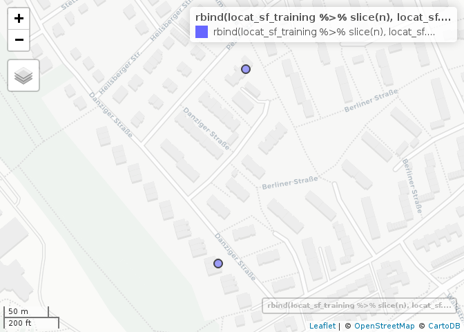
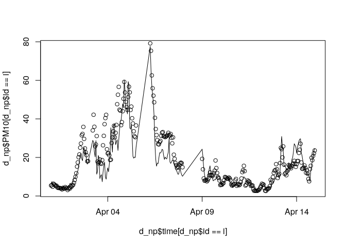
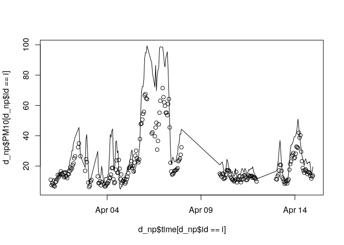
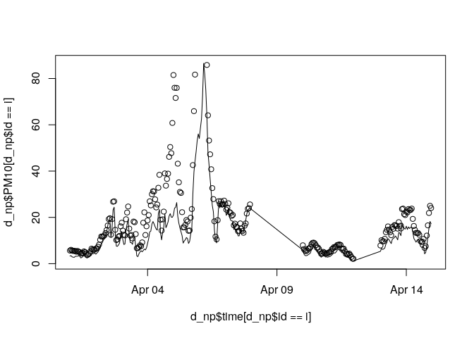
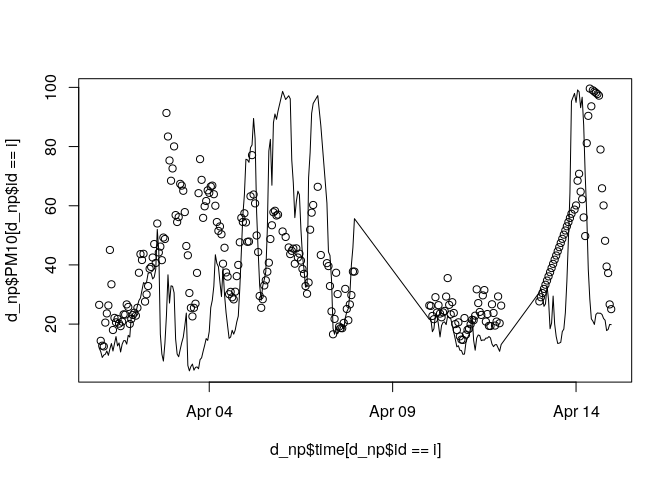
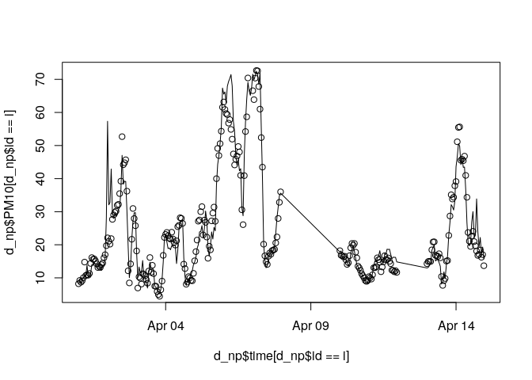
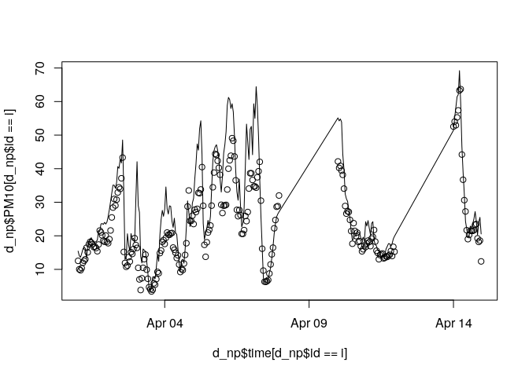
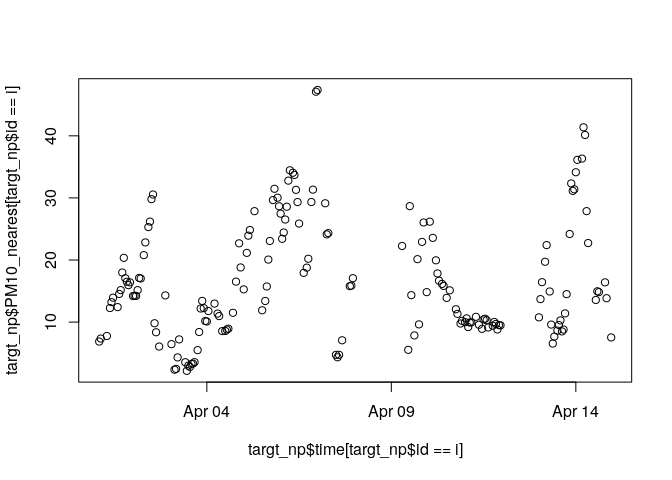
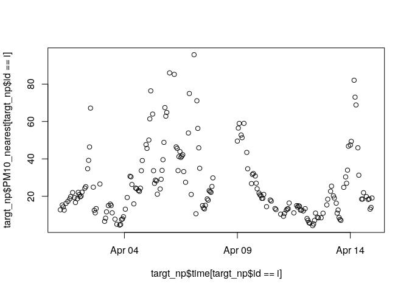
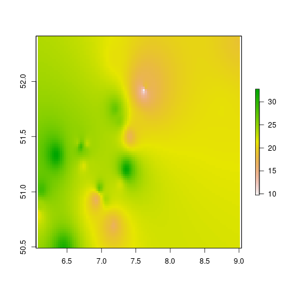

<!-- README.md is generated from README.Rmd. Please edit that file -->

# AQPrediction

<!-- badges: start -->

<!-- badges: end -->

The goal of this repo is to demonstrate spatio-temporal prediction
models to estimate levels of air pollution.

The input dataset is an Excel
[file](https://drive.google.com/open?id=14GvlMCBLR9FQ_BsCeg0tj-pb1AadXr3G3gKPnrfm8gg)
provided as part of the [OpenGeoHub Summer
School 2019](https://opengeohub.org/summer_school_2019).

We’ll use these packages

``` r
suppressPackageStartupMessages({
  library(dplyr)
  library(sf)
  library(ranger)
  library (CAST)
  library(caret)
  library(tmap)
  library(lubridate)
})
tmap_mode("view")
#> tmap mode set to interactive viewing
```

And read-in the input data as follows

``` r
piggyback::pb_upload("SpatialPrediction.xlsx")
train = readxl::read_excel("SpatialPrediction.xlsx", sheet = 1)
covar = readxl::read_excel("SpatialPrediction.xlsx", sheet = 2)
locat = readxl::read_excel("SpatialPrediction.xlsx", sheet = 3)
# times = readxl::read_excel("SpatialPrediction.xlsx", sheet = 4) # what is this? -->Their test set. They will use to check our model
targt = readxl::read_excel("SpatialPrediction.xlsx", sheet = 5)
# keep only useful vars
targt = targt %>% select(id, time) %>% 
  na.omit()
tail(targt)
#> # A tibble: 6 x 2
#>   id                       time               
#>   <chr>                    <dttm>             
#> 1 5c57147435809500190ef1fd 2019-04-01 23:00:00
#> 2 5aa54845396417001ba4664a 2019-04-11 21:00:00
#> 3 59217fee51d34600117f8a50 2019-04-12 10:00:00
#> 4 59217fee51d34600117f8a50 2019-04-09 08:00:00
#> 5 5a636a22411a790019bdcafd 2019-04-02 09:00:00
#> 6 59607bb394f0520011ad22fa 2019-04-13 03:00:00
wind = readRDS ("ERA5_24h_uvWind_precip.RDS") ## CHECK if the path is correct.
```

The objective is to fill the NA values in the `targt` data:

``` r
targt
#> # A tibble: 5,000 x 2
#>    id                       time               
#>    <chr>                    <dttm>             
#>  1 5a5da3c80aa2a900127f895a 2019-04-06 18:00:00
#>  2 590752d15ba9e500112b21db 2019-04-09 06:00:00
#>  3 5a58cb80999d43001b7c4ecb 2019-04-03 22:00:00
#>  4 5a5da3c80aa2a900127f895a 2019-04-03 00:00:00
#>  5 5a636a22411a790019bdcafd 2019-04-07 10:00:00
#>  6 5c49b10c35acab0019e6ce19 2019-04-03 16:00:00
#>  7 5a1b3c7d19991f0011b83054 2019-04-14 04:00:00
#>  8 5c57147435809500190ef1fd 2019-04-06 12:00:00
#>  9 5978e8fbfe1c74001199fa2a 2019-04-06 07:00:00
#> 10 5909d039dd09cc001199a6bf 2019-04-09 15:00:00
#> # … with 4,990 more rows
```

Let’s do some data cleaning and plot the data:

``` r
d = inner_join(train, covar)
#> Joining, by = c("id", "time")
d = inner_join(d, locat)
#> Joining, by = "id"
# d = merge(d, wind, by.x=c("id", "time"), by.y=c("monitors.id", "date")) ### inner_join to join using two columns????
wind_renamed = wind %>% 
  rename(id = monitors.id, time = date)
d = left_join(d, wind_renamed)
#> Joining, by = c("id", "time")
#> Warning: Column `id` joining character vector and factor, coercing into
#> character vector
class(d$time)
#> [1] "POSIXct" "POSIXt"
d$dow  <- weekdays.POSIXt(d$time) # I included in the wind file
d$hour <- hour(d$time) # I included in the wind file
head(d); nrow(d)
#> # A tibble: 6 x 13
#>   id    time                 PM10 humidity temperature     X     Y era5_id
#>   <chr> <dttm>              <dbl>    <dbl>       <dbl> <dbl> <dbl>   <dbl>
#> 1 581d… 2019-04-01 00:00:00  4.16     64.4        2.1   6.46  51.8     540
#> 2 581d… 2019-04-01 01:00:00  4.99     64.7        1.65  6.46  51.8     540
#> 3 581d… 2019-04-01 02:00:00  4.88     65.1        1.15  6.46  51.8     540
#> 4 581d… 2019-04-01 03:00:00  6.68     65.3        0.7   6.46  51.8     540
#> 5 581d… 2019-04-01 04:00:00  5.4      65.6        0.4   6.46  51.8     540
#> 6 581d… 2019-04-01 05:00:00  6.57     67.6        0.3   6.46  51.8     540
#> # … with 5 more variables: u10 <dbl>, dow <chr>, hour <int>, v10 <dbl>,
#> #   tp <dbl>
#> [1] 23719


# dsf = sf::st_as_sf(d, coords = c("X", "Y"), crs = 4326) # ducplicated geometries
locat_sf = st_as_sf(locat, coords = c("X", "Y"), crs = 4326)
summary(locat_sf)
#>       id                     geometry  
#>  Length:118         POINT        :118  
#>  Class :character   epsg:4326    :  0  
#>  Mode  :character   +proj=long...:  0
mapview::mapview(locat_sf)
```

<!-- -->

## Exploratory anaysis

How many points in the target are in the training data?

``` r
nrow(locat)
#> [1] 118
length(unique(d$id))
#> [1] 87
length(unique(targt$id))
#> [1] 30
summary(targt$id %in% d$id)
#>    Mode   FALSE 
#> logical    5000
targt_locat = inner_join(targt, locat)
#> Joining, by = "id"
targt_joined = left_join(targt_locat, covar)
#> Joining, by = c("id", "time")
targt_joined = left_join(targt_joined, wind_renamed)
#> Joining, by = c("id", "time")
#> Warning: Column `id` joining character vector and factor, coercing into
#> character vector
targt_sf = st_as_sf(targt_joined, coords = c("X", "Y"))

nrow(locat_sf)
#> [1] 118
locat_sf$is_target = locat_sf$id %in% targt$id
tm_shape(locat_sf) + tm_dots("is_target") + tm_scale_bar()
```

<!-- -->

``` r
locat_sf_training = locat_sf %>% filter(!is_target)
locat_sf_targt = locat_sf %>% filter(is_target)

# identify points in close proximity in training dataset
d_distance_matrix = st_distance(locat_sf_training)
d_distance_matrix = apply(d_distance_matrix, 1, as.numeric)
summary(d_distance_matrix[1, ])
#>    Min. 1st Qu.  Median    Mean 3rd Qu.    Max. 
#>       0   70612   93049   98874  128534  185894
d_distance_matrix[d_distance_matrix == 0] = NA
mins1 = apply(d_distance_matrix, 1, min, na.rm = TRUE)
which_mins1 = apply(d_distance_matrix, 1, which.min)
ids_min = locat_sf_training$id[which_mins1]
# d_nearest_training = st_nearest_feature(locat_sf_training, locat_sf_training)


# test it with random point: 5
nearest_to_5 = locat_sf_training %>% filter(id == ids_min[9])
nearest_to_5_and_5 = rbind(locat_sf_training[5, ], nearest_to_5)
tm_shape(nearest_to_5_and_5) + tm_dots() +
  tm_shape(locat_sf_training) + tm_dots(col = "red") +
  tm_shape(nearest_to_5_and_5) + tm_dots() 
```

<!-- -->

``` r

mins_training_target = st_distance(locat_sf_training)
min1_1 = which.min(mins1)
# which.min(d_distance_matrix)

min1_2 = which.min(d_distance_matrix[min1_1, ])
locat_sf_training_min1 = locat_sf_training %>% 
  slice(c(min1_1, min1_2))
mapview::mapview(locat_sf_training_min1)
```

<!-- -->

``` r

# check similarity
d_pair1 = d %>% 
  filter(id %in% locat_sf_training_min1$id)

d_pair1 %>% 
  ggplot() +
  geom_line(aes(time, PM10, col = id)) # omg they are the same!
```

<!-- -->

``` r

d %>% 
  filter(id %in% locat$id[1:9]) %>% 
  ggplot() +
  geom_line(aes(time, PM10, col = id)) # omg they are the same!
```

<!-- -->

``` r


# cor(d_pair1$PM10[d_pair1$id == locat_sf_training_min1$id[1]],
#     d_pair1$PM10[d_pair1$id == locat_sf_training_min1$id[2]]) 

# work out how to predict from the nearest...

# get distance to nearest for all training data
locat_sf_training$distance_to_nearest = mins1
# inner_join(d, locat_sf_training)
locat_sf_training$id_nearest = NA
i = 1
for(i in 1:nrow(locat_sf_training)) {
  nearest_point = min(d_distance_matrix[i, ], na.rm = TRUE)
  index_nearest = which(d_distance_matrix[, i] == nearest_point)
  locat_sf_training$id_nearest[i] = locat_sf_training$id[index_nearest]
}
locat_sf_training %>% select(id, id_nearest)
#> Simple feature collection with 88 features and 2 fields
#> geometry type:  POINT
#> dimension:      XY
#> bbox:           xmin: 6.080338 ymin: 50.67484 xmax: 9.023477 ymax: 52.45251
#> epsg (SRID):    4326
#> proj4string:    +proj=longlat +datum=WGS84 +no_defs
#> # A tibble: 88 x 3
#>    id                       id_nearest                          geometry
#>  * <chr>                    <chr>                            <POINT [°]>
#>  1 581dab879337ed000f6b308d 59744fc5fe1c74001155db40 (6.463924 51.82994)
#>  2 584e9e9e16c08e000fb7e146 5aabddd2850005001bba0761 (6.691457 50.87299)
#>  3 5852edf116c08e000fd20768 5ae76e9a223bd80019136179 (7.490391 51.85772)
#>  4 58f7a793161fa50011096eb5 5ab55cb5850005001b06f8cf (8.656207 52.45251)
#>  5 59084e025ba9e5001134b4ca 59f268fb50a2aa000f4d3597 (7.705384 51.57444)
#>  6 591216ec51d3460011ec8174 5b2ac6441fef04001b27eb32 (7.414259 51.50182)
#>  7 5926719e51d3460011af420e 5b8eeadc7c51910019ff1903 (6.609135 51.48667)
#>  8 593c20216ccf3b00117ca2d6 59ad958fd67eb50011b85f6d (7.620859 51.90518)
#>  9 5945106fa4ad59001113c04e 5b9f44e27c51910019f9d255  (7.21562 51.03883)
#> 10 594819c8a4ad59001132a024 5b9f44e27c51910019f9d255 (7.065325 51.04144)
#> # … with 78 more rows

# check on random numbers
n = 26
mapview::mapview(rbind(
  locat_sf_training %>% slice(n),
  locat_sf_training %>% filter(id == locat_sf_training$id_nearest[n])
))
```

<!-- -->

``` r

# now calculate distance for target
d_distance_matrix = st_distance(locat_sf_targt, locat_sf_training)
d_distance_matrix = apply(d_distance_matrix, 1, as.numeric)
summary(d_distance_matrix[1, ])
#>    Min. 1st Qu.  Median    Mean 3rd Qu.    Max. 
#>   44424   66468   88004   94638  109119  186106
d_distance_matrix[d_distance_matrix == 0] = NA
mins1 = apply(d_distance_matrix, 2, min, na.rm = TRUE)
summary(mins1)
#>     Min.  1st Qu.   Median     Mean  3rd Qu.     Max. 
#>    23.16  1114.52  2419.89  4855.42  6382.10 38478.91
length(mins1) == nrow(locat_sf_targt)
#> [1] TRUE
locat_sf_targt$distance_to_nearest = mins1

dim(d_distance_matrix)
#> [1] 88 30
i = 1
locat_sf_targt$id_nearest = NA
for(i in 1:nrow(locat_sf_targt)) {
  nearest_point = min(d_distance_matrix[, i], na.rm = TRUE)
  index_nearest = which(d_distance_matrix[, i] == nearest_point)
  locat_sf_targt$id_nearest[i] = locat_sf_training$id[index_nearest]
}

n = 2
nearest_to_test = locat_sf_training %>% 
  filter(id == locat_sf_targt$id_nearest[n])
mapview::mapview(rbind(
  locat_sf_targt %>% slice(n),
  nearest_to_test
))
```

<!-- -->

``` r


# timeseries tests
summary(targt$time %in% d$time)
#>    Mode    TRUE 
#> logical    5000
names(locat_sf_targt)
#> [1] "id"                  "geometry"            "is_target"          
#> [4] "distance_to_nearest" "id_nearest"

# joining distance + id to training + target vars
names(d)
#>  [1] "id"          "time"        "PM10"        "humidity"    "temperature"
#>  [6] "X"           "Y"           "era5_id"     "u10"         "dow"        
#> [11] "hour"        "v10"         "tp"
d_np = inner_join(d, locat_sf_training)
#> Joining, by = "id"
targt_np = targt_sf %>% st_drop_geometry() %>% 
  inner_join(., locat_sf_targt)
#> Joining, by = "id"

i = 5
# get prediction for all times in test
test_training1 = d_np %>% slice(n)
training_nearest = d_np %>% filter(id == test_training1$id_nearest[i])
plot(test_training1$time, test_training1$PM10, type = "line", ylim = c(0, 99))
#> Warning in plot.xy(xy, type, ...): plot type 'line' will be truncated to
#> first character
points(training_nearest$time, training_nearest$PM10)
```

<!-- -->

``` r
test_training1_joined = inner_join(
  test_training1,
  training_nearest %>% select(time, PM10_nearest = PM10),
  
)
#> Joining, by = "time"
summary(test_training1_joined$PM10_nearest)
#>    Min. 1st Qu.  Median    Mean 3rd Qu.    Max. 
#> 
test_training1_joined$PM10_nearest = imputeTS::na_interpolation(x = test_training1_joined$PM10_nearest)
#> Registered S3 method overwritten by 'xts':
#>   method     from
#>   as.zoo.xts zoo
#> Registered S3 method overwritten by 'quantmod':
#>   method            from
#>   as.zoo.data.frame zoo
#> Registered S3 methods overwritten by 'forecast':
#>   method             from    
#>   fitted.fracdiff    fracdiff
#>   residuals.fracdiff fracdiff

plot(test_training1$time, test_training1$PM10, type = "line", ylim = c(0, 99))
#> Warning in plot.xy(xy, type, ...): plot type 'line' will be truncated to
#> first character
points(test_training1_joined$time, test_training1_joined$PM10_nearest)
```

<!-- -->

``` r

# For loop to find nearest
d_np$PM10_nearest = NA
ids_training = unique(unique(d_np$id))
i = ids_training[22]
for(i in ids_training) {
  test_training1 = d_np %>% filter(id == i)
  training_nearest = d_np %>% filter(id == test_training1$id_nearest[1])
  test_training1_joined = left_join(
  test_training1,
  training_nearest %>% select(time, PM10_n = PM10)
  )
  if(sum(!is.na(test_training1_joined$PM10_n)) > 2 ){
      test_training1_joined$PM10_nearest = imputeTS::na_interpolation(x = test_training1_joined$PM10_n)

  d_np$PM10_nearest[d_np$id == i] = test_training1_joined$PM10_nearest 
  
  plot(d_np$time[d_np$id == i], d_np$PM10[d_np$id == i], type = "line")
  points(d_np$time[d_np$id == i], d_np$PM10_nearest[d_np$id == i])
  } else {
    message("Skipping id", i)
  }

}
#> Joining, by = "time"
#> Warning in plot.xy(xy, type, ...): plot type 'line' will be truncated to
#> first character
#> Joining, by = "time"
```

<!-- -->

    #> Warning in plot.xy(xy, type, ...): plot type 'line' will be truncated to
    #> first character
    #> Joining, by = "time"

<!-- -->

    #> Warning in plot.xy(xy, type, ...): plot type 'line' will be truncated to
    #> first character
    #> Joining, by = "time"

<!-- -->

    #> Warning in plot.xy(xy, type, ...): plot type 'line' will be truncated to
    #> first character
    #> Joining, by = "time"

<!-- -->

    #> Warning in plot.xy(xy, type, ...): plot type 'line' will be truncated to
    #> first character
    #> Joining, by = "time"

<!-- -->

    #> Warning in plot.xy(xy, type, ...): plot type 'line' will be truncated to
    #> first character
    #> Joining, by = "time"

<!-- -->

    #> Warning in plot.xy(xy, type, ...): plot type 'line' will be truncated to
    #> first character
    #> Joining, by = "time"

<!-- -->

    #> Warning in plot.xy(xy, type, ...): plot type 'line' will be truncated to
    #> first character
    #> Joining, by = "time"

<!-- -->

    #> Warning in plot.xy(xy, type, ...): plot type 'line' will be truncated to
    #> first character
    #> Joining, by = "time"

<!-- -->

    #> Warning in plot.xy(xy, type, ...): plot type 'line' will be truncated to
    #> first character
    #> Joining, by = "time"

<!-- -->

    #> Warning in plot.xy(xy, type, ...): plot type 'line' will be truncated to
    #> first character
    #> Joining, by = "time"

<!-- -->

    #> Warning in plot.xy(xy, type, ...): plot type 'line' will be truncated to
    #> first character
    #> Joining, by = "time"

<!-- -->

    #> Warning in plot.xy(xy, type, ...): plot type 'line' will be truncated to
    #> first character
    #> Joining, by = "time"

<!-- -->

    #> Warning in plot.xy(xy, type, ...): plot type 'line' will be truncated to
    #> first character
    #> Joining, by = "time"

<!-- -->

    #> Warning in plot.xy(xy, type, ...): plot type 'line' will be truncated to
    #> first character
    #> Joining, by = "time"

<!-- -->

    #> Warning in plot.xy(xy, type, ...): plot type 'line' will be truncated to
    #> first character
    #> Joining, by = "time"

<!-- -->

    #> Warning in plot.xy(xy, type, ...): plot type 'line' will be truncated to
    #> first character
    #> Joining, by = "time"

<!-- -->

    #> Warning in plot.xy(xy, type, ...): plot type 'line' will be truncated to
    #> first character
    #> Joining, by = "time"
    #> Skipping id599c9b80d67eb500118c6b5e
    #> Joining, by = "time"

<!-- -->

    #> Warning in plot.xy(xy, type, ...): plot type 'line' will be truncated to
    #> first character
    #> Joining, by = "time"

<!-- -->

    #> Warning in plot.xy(xy, type, ...): plot type 'line' will be truncated to
    #> first character
    #> Joining, by = "time"

<!-- -->

    #> Warning in plot.xy(xy, type, ...): plot type 'line' will be truncated to
    #> first character
    #> Joining, by = "time"

<!-- -->

    #> Warning in plot.xy(xy, type, ...): plot type 'line' will be truncated to
    #> first character
    #> Joining, by = "time"

<!-- -->

    #> Warning in plot.xy(xy, type, ...): plot type 'line' will be truncated to
    #> first character
    #> Joining, by = "time"

<!-- -->

    #> Warning in plot.xy(xy, type, ...): plot type 'line' will be truncated to
    #> first character
    #> Joining, by = "time"

<!-- -->

    #> Warning in plot.xy(xy, type, ...): plot type 'line' will be truncated to
    #> first character
    #> Joining, by = "time"

<!-- -->

    #> Warning in plot.xy(xy, type, ...): plot type 'line' will be truncated to
    #> first character
    #> Joining, by = "time"

<!-- -->

    #> Warning in plot.xy(xy, type, ...): plot type 'line' will be truncated to
    #> first character
    #> Joining, by = "time"

<!-- -->

    #> Warning in plot.xy(xy, type, ...): plot type 'line' will be truncated to
    #> first character
    #> Joining, by = "time"

<!-- -->

    #> Warning in plot.xy(xy, type, ...): plot type 'line' will be truncated to
    #> first character
    #> Joining, by = "time"

<!-- -->

    #> Warning in plot.xy(xy, type, ...): plot type 'line' will be truncated to
    #> first character
    #> Joining, by = "time"

<!-- -->

    #> Warning in plot.xy(xy, type, ...): plot type 'line' will be truncated to
    #> first character
    #> Joining, by = "time"

<!-- -->

    #> Warning in plot.xy(xy, type, ...): plot type 'line' will be truncated to
    #> first character
    #> Joining, by = "time"

<!-- -->

    #> Warning in plot.xy(xy, type, ...): plot type 'line' will be truncated to
    #> first character
    #> Joining, by = "time"

<!-- -->

    #> Warning in plot.xy(xy, type, ...): plot type 'line' will be truncated to
    #> first character
    #> Joining, by = "time"

<!-- -->

    #> Warning in plot.xy(xy, type, ...): plot type 'line' will be truncated to
    #> first character
    #> Joining, by = "time"

<!-- -->

    #> Warning in plot.xy(xy, type, ...): plot type 'line' will be truncated to
    #> first character
    #> Joining, by = "time"

<!-- -->

    #> Warning in plot.xy(xy, type, ...): plot type 'line' will be truncated to
    #> first character
    #> Joining, by = "time"

<!-- -->

    #> Warning in plot.xy(xy, type, ...): plot type 'line' will be truncated to
    #> first character
    #> Joining, by = "time"

<!-- -->

    #> Warning in plot.xy(xy, type, ...): plot type 'line' will be truncated to
    #> first character
    #> Joining, by = "time"

<!-- -->

    #> Warning in plot.xy(xy, type, ...): plot type 'line' will be truncated to
    #> first character
    #> Joining, by = "time"

<!-- -->

    #> Warning in plot.xy(xy, type, ...): plot type 'line' will be truncated to
    #> first character
    #> Joining, by = "time"

<!-- -->

    #> Warning in plot.xy(xy, type, ...): plot type 'line' will be truncated to
    #> first character
    #> Joining, by = "time"

<!-- -->

    #> Warning in plot.xy(xy, type, ...): plot type 'line' will be truncated to
    #> first character
    #> Joining, by = "time"

<!-- -->

    #> Warning in plot.xy(xy, type, ...): plot type 'line' will be truncated to
    #> first character
    #> Joining, by = "time"

<!-- -->

    #> Warning in plot.xy(xy, type, ...): plot type 'line' will be truncated to
    #> first character
    #> Joining, by = "time"

<!-- -->

    #> Warning in plot.xy(xy, type, ...): plot type 'line' will be truncated to
    #> first character
    #> Joining, by = "time"

<!-- -->

    #> Warning in plot.xy(xy, type, ...): plot type 'line' will be truncated to
    #> first character
    #> Joining, by = "time"

<!-- -->

    #> Warning in plot.xy(xy, type, ...): plot type 'line' will be truncated to
    #> first character
    #> Joining, by = "time"

<!-- -->

    #> Warning in plot.xy(xy, type, ...): plot type 'line' will be truncated to
    #> first character
    #> Joining, by = "time"

<!-- -->

    #> Warning in plot.xy(xy, type, ...): plot type 'line' will be truncated to
    #> first character
    #> Joining, by = "time"

<!-- -->

    #> Warning in plot.xy(xy, type, ...): plot type 'line' will be truncated to
    #> first character
    #> Joining, by = "time"

<!-- -->

    #> Warning in plot.xy(xy, type, ...): plot type 'line' will be truncated to
    #> first character
    #> Joining, by = "time"

<!-- -->

    #> Warning in plot.xy(xy, type, ...): plot type 'line' will be truncated to
    #> first character
    #> Joining, by = "time"

<!-- -->

    #> Warning in plot.xy(xy, type, ...): plot type 'line' will be truncated to
    #> first character
    #> Joining, by = "time"

<!-- -->

    #> Warning in plot.xy(xy, type, ...): plot type 'line' will be truncated to
    #> first character
    #> Joining, by = "time"

<!-- -->

    #> Warning in plot.xy(xy, type, ...): plot type 'line' will be truncated to
    #> first character
    #> Joining, by = "time"

<!-- -->

    #> Warning in plot.xy(xy, type, ...): plot type 'line' will be truncated to
    #> first character
    #> Joining, by = "time"

<!-- -->

    #> Warning in plot.xy(xy, type, ...): plot type 'line' will be truncated to
    #> first character
    #> Joining, by = "time"

<!-- -->

    #> Warning in plot.xy(xy, type, ...): plot type 'line' will be truncated to
    #> first character
    #> Joining, by = "time"

<!-- -->

    #> Warning in plot.xy(xy, type, ...): plot type 'line' will be truncated to
    #> first character
    #> Joining, by = "time"

<!-- -->

    #> Warning in plot.xy(xy, type, ...): plot type 'line' will be truncated to
    #> first character
    #> Joining, by = "time"

<!-- -->

    #> Warning in plot.xy(xy, type, ...): plot type 'line' will be truncated to
    #> first character
    #> Joining, by = "time"

<!-- -->

    #> Warning in plot.xy(xy, type, ...): plot type 'line' will be truncated to
    #> first character
    #> Joining, by = "time"

<!-- -->

    #> Warning in plot.xy(xy, type, ...): plot type 'line' will be truncated to
    #> first character
    #> Joining, by = "time"

<!-- -->

    #> Warning in plot.xy(xy, type, ...): plot type 'line' will be truncated to
    #> first character
    #> Joining, by = "time"

<!-- -->

    #> Warning in plot.xy(xy, type, ...): plot type 'line' will be truncated to
    #> first character
    #> Joining, by = "time"

<!-- -->

    #> Warning in plot.xy(xy, type, ...): plot type 'line' will be truncated to
    #> first character
    #> Joining, by = "time"
    #> Skipping id5b69c0bb9c135100199dd67c
    #> Joining, by = "time"

<!-- -->

    #> Warning in plot.xy(xy, type, ...): plot type 'line' will be truncated to
    #> first character
    #> Joining, by = "time"

<!-- -->

    #> Warning in plot.xy(xy, type, ...): plot type 'line' will be truncated to
    #> first character
    #> Joining, by = "time"

<!-- -->

    #> Warning in plot.xy(xy, type, ...): plot type 'line' will be truncated to
    #> first character
    #> Joining, by = "time"

<!-- -->

    #> Warning in plot.xy(xy, type, ...): plot type 'line' will be truncated to
    #> first character
    #> Joining, by = "time"

<!-- -->

    #> Warning in plot.xy(xy, type, ...): plot type 'line' will be truncated to
    #> first character
    #> Joining, by = "time"

<!-- -->

    #> Warning in plot.xy(xy, type, ...): plot type 'line' will be truncated to
    #> first character
    #> Joining, by = "time"

<!-- -->

    #> Warning in plot.xy(xy, type, ...): plot type 'line' will be truncated to
    #> first character
    #> Joining, by = "time"

<!-- -->

    #> Warning in plot.xy(xy, type, ...): plot type 'line' will be truncated to
    #> first character
    #> Joining, by = "time"

<!-- -->

    #> Warning in plot.xy(xy, type, ...): plot type 'line' will be truncated to
    #> first character
    #> Joining, by = "time"

<!-- -->

    #> Warning in plot.xy(xy, type, ...): plot type 'line' will be truncated to
    #> first character
    #> Joining, by = "time"

<!-- -->

    #> Warning in plot.xy(xy, type, ...): plot type 'line' will be truncated to
    #> first character
    #> Joining, by = "time"

<!-- -->

    #> Warning in plot.xy(xy, type, ...): plot type 'line' will be truncated to
    #> first character
    #> Joining, by = "time"

<!-- -->

    #> Warning in plot.xy(xy, type, ...): plot type 'line' will be truncated to
    #> first character
    #> Joining, by = "time"

<!-- -->

    #> Warning in plot.xy(xy, type, ...): plot type 'line' will be truncated to
    #> first character
    #> Joining, by = "time"

<!-- -->

    #> Warning in plot.xy(xy, type, ...): plot type 'line' will be truncated to
    #> first character
    #> Joining, by = "time"

<!-- -->

    #> Warning in plot.xy(xy, type, ...): plot type 'line' will be truncated to
    #> first character
    #> Joining, by = "time"

<!-- -->

    #> Warning in plot.xy(xy, type, ...): plot type 'line' will be truncated to
    #> first character
    #> Joining, by = "time"

<!-- -->

    #> Warning in plot.xy(xy, type, ...): plot type 'line' will be truncated to
    #> first character

<!-- -->

``` r

# View(d_np)
cor(d_np$PM10, d_np$PM10_nearest, use = "complete.obs")
#> [1] 0.637448
saveRDS(d_np, "d_np.Rds")
piggyback::pb_upload("d_np.Rds")
#> uploading d_np.Rds ...
#> 
  |                                                                       
  |                                                                 |   0%
  |                                                                       
  |==                                                               |   3%
  |                                                                       
  |====                                                             |   6%
  |                                                                       
  |======                                                           |  10%
  |                                                                       
  |========                                                         |  13%
  |                                                                       
  |==========                                                       |  16%
  |                                                                       
  |=============                                                    |  19%
  |                                                                       
  |===============                                                  |  23%
  |                                                                       
  |=================                                                |  26%
  |                                                                       
  |===================                                              |  29%
  |                                                                       
  |=====================                                            |  32%
  |                                                                       
  |=======================                                          |  35%
  |                                                                       
  |=========================                                        |  39%
  |                                                                       
  |===========================                                      |  42%
  |                                                                       
  |=============================                                    |  45%
  |                                                                       
  |===============================                                  |  48%
  |                                                                       
  |==================================                               |  52%
  |                                                                       
  |====================================                             |  55%
  |                                                                       
  |======================================                           |  58%
  |                                                                       
  |========================================                         |  61%
  |                                                                       
  |==========================================                       |  64%
  |                                                                       
  |============================================                     |  68%
  |                                                                       
  |==============================================                   |  71%
  |                                                                       
  |================================================                 |  74%
  |                                                                       
  |==================================================               |  77%
  |                                                                       
  |====================================================             |  81%
  |                                                                       
  |======================================================           |  84%
  |                                                                       
  |=========================================================        |  87%
  |                                                                       
  |===========================================================      |  90%
  |                                                                       
  |=============================================================    |  93%
  |                                                                       
  |===============================================================  |  97%
  |                                                                       
  |=================================================================| 100%

# For loop to find nearest in target
targt_np$PM10_nearest = NA
ids_training = unique(unique(targt_np$id))
i = ids_training[22]
for(i in ids_training) {
  test_training1 = targt_np %>% filter(id == i)
  training_nearest = d_np %>% filter(id == test_training1$id_nearest[1])
  test_training1_joined = left_join(
  test_training1,
  training_nearest %>% select(time, PM10_n = PM10)
  )
  if(sum(!is.na(test_training1_joined$PM10_n)) > 2 ){
      test_training1_joined$PM10_nearest = imputeTS::na_interpolation(x = test_training1_joined$PM10_n)

  targt_np$PM10_nearest[targt_np$id == i] = test_training1_joined$PM10_nearest 
  
  plot(targt_np$time[targt_np$id == i], targt_np$PM10_nearest[targt_np$id == i])
  } else {
    message("Skipping id", i)
  }

}
#> Joining, by = "time"
#> Joining, by = "time"
```

<!-- -->

    #> Joining, by = "time"

<!-- -->

    #> Joining, by = "time"

<!-- -->

    #> Joining, by = "time"

<!-- -->

    #> Joining, by = "time"

<!-- -->

    #> Joining, by = "time"

<!-- -->

    #> Joining, by = "time"

<!-- -->

    #> Joining, by = "time"

<!-- -->

    #> Joining, by = "time"

<!-- -->

    #> Joining, by = "time"

<!-- -->

    #> Joining, by = "time"

<!-- -->

    #> Joining, by = "time"

<!-- -->

    #> Joining, by = "time"

<!-- -->

    #> Joining, by = "time"

<!-- -->

    #> Joining, by = "time"

<!-- -->

    #> Joining, by = "time"

<!-- -->

    #> Joining, by = "time"

<!-- -->

    #> Joining, by = "time"

<!-- -->

    #> Joining, by = "time"

<!-- -->

    #> Joining, by = "time"

<!-- -->

    #> Joining, by = "time"

<!-- -->

    #> Joining, by = "time"

<!-- -->

    #> Joining, by = "time"

<!-- -->

    #> Joining, by = "time"

<!-- -->

    #> Joining, by = "time"

<!-- -->

    #> Joining, by = "time"

<!-- -->

    #> Joining, by = "time"

<!-- -->

    #> Joining, by = "time"

<!-- -->

    #> Joining, by = "time"

<!-- --><!-- -->

``` r
saveRDS(targt_np, "targt_np.Rds")
piggyback::pb_upload("targt_np.Rds")
#> uploading targt_np.Rds ...
#> 
  |                                                                       
  |                                                                 |   0%
  |                                                                       
  |======                                                           |   9%
  |                                                                       
  |============                                                     |  19%
  |                                                                       
  |==================                                               |  28%
  |                                                                       
  |========================                                         |  38%
  |                                                                       
  |===============================                                  |  47%
  |                                                                       
  |=====================================                            |  56%
  |                                                                       
  |===========================================                      |  66%
  |                                                                       
  |=================================================                |  75%
  |                                                                       
  |=======================================================          |  85%
  |                                                                       
  |=============================================================    |  94%
  |                                                                       
  |=================================================================| 100%
```

``` r
## FORMULA ##
formula = as.formula(PM10 ~  humidity + temperature + (X*Y) + u10 + v10 + tp + dow + hour)
```

A simple model:

``` r
##\\LINEAR//##
m = lm(formula, data = d)
## Are all the predictors significant? Let's check!
summary(m)
#> 
#> Call:
#> lm(formula = formula, data = d)
#> 
#> Residuals:
#>     Min      1Q  Median      3Q     Max 
#> -32.693  -9.089  -2.697   5.429  87.865 
#> 
#> Coefficients:
#>                Estimate Std. Error t value Pr(>|t|)    
#> (Intercept)  -1.413e+03  1.103e+02 -12.812  < 2e-16 ***
#> humidity      8.127e-02  4.167e-03  19.503  < 2e-16 ***
#> temperature  -2.817e-02  5.517e-03  -5.106 3.32e-07 ***
#> X             1.849e+02  1.476e+01  12.524  < 2e-16 ***
#> Y             2.787e+01  2.134e+00  13.062  < 2e-16 ***
#> u10          -1.937e-02  8.843e-02  -0.219  0.82658    
#> v10           9.826e-01  6.061e-02  16.212  < 2e-16 ***
#> tp           -1.758e+03  5.656e+02  -3.108  0.00189 ** 
#> dowMonday    -1.425e+01  4.763e-01 -29.913  < 2e-16 ***
#> dowSaturday   3.950e+00  3.863e-01  10.225  < 2e-16 ***
#> dowSunday     1.854e-01  3.967e-01   0.467  0.64035    
#> dowThursday  -1.013e+01  3.774e-01 -26.838  < 2e-16 ***
#> dowTuesday   -6.313e+00  4.474e-01 -14.110  < 2e-16 ***
#> dowWednesday -1.268e+01  3.826e-01 -33.153  < 2e-16 ***
#> hour         -1.794e-01  1.436e-02 -12.499  < 2e-16 ***
#> X:Y          -3.589e+00  2.853e-01 -12.581  < 2e-16 ***
#> ---
#> Signif. codes:  0 '***' 0.001 '**' 0.01 '*' 0.05 '.' 0.1 ' ' 1
#> 
#> Residual standard error: 15.02 on 23617 degrees of freedom
#>   (86 observations deleted due to missingness)
#> Multiple R-squared:  0.1952, Adjusted R-squared:  0.1947 
#> F-statistic:   382 on 15 and 23617 DF,  p-value: < 2.2e-16

lm.df = d
lm.df$pred = predict(m, newdata = lm.df)
lm.random = lm(PM10 ~ pred, data=lm.df)
summary(lm.random)
#> 
#> Call:
#> lm(formula = PM10 ~ pred, data = lm.df)
#> 
#> Residuals:
#>     Min      1Q  Median      3Q     Max 
#> -32.693  -9.089  -2.697   5.429  87.865 
#> 
#> Coefficients:
#>              Estimate Std. Error t value Pr(>|t|)    
#> (Intercept) 1.353e-11  2.790e-01    0.00        1    
#> pred        1.000e+00  1.321e-02   75.72   <2e-16 ***
#> ---
#> Signif. codes:  0 '***' 0.001 '**' 0.01 '*' 0.05 '.' 0.1 ' ' 1
#> 
#> Residual standard error: 15.01 on 23631 degrees of freedom
#>   (86 observations deleted due to missingness)
#> Multiple R-squared:  0.1952, Adjusted R-squared:  0.1952 
#> F-statistic:  5733 on 1 and 23631 DF,  p-value: < 2.2e-16
plot(lm.df$PM10, lm.df$pred)
```

<!-- -->

``` r
cor(lm.df$PM10, lm.df$pred)^2
#> [1] NA
```

A simple linear model can explain ~19% of the variability in PM10
levels, not great\!

## Add roads

``` r
bb = st_bbox(locat_sf)
```

See www.osm.org for major roads

``` r
# library(osmdata)
# osm_data = opq(bbox = bb) %>% 
#   add_osm_feature(key = "highway", value = "motorway") %>% 
#   osmdata_sf()
download.file("http://download.geofabrik.de/europe/germany/nordrhein-westfalen-latest-free.shp.zip", "roads.zip")
unzip("roads.zip")
# osm_westfalen_traffic = sf::read_sf("gis_osm_traffic_a_free_1.shp")
osm_westfalen_transport = sf::read_sf("gis_osm_roads_free_1.shp")
osm_westfalen_transport
mapview::mapview(osm_westfalen[1:999, ])
saveRDS(osm_westfalen_transport, "roads-all.Rds")
table(osm_westfalen_transport$fclass)
roads_big = osm_westfalen_transport %>% 
  filter(grepl(pattern = "motorway|primary|trunk|second|resi", fclass))
mapview::mapview(roads_big %>% sample_n(100)) +
  mapview::mapview(locat_sf)
saveRDS(roads_big, "roads_big.Rds")
```

``` r
roads_big = readRDS("roads_big.Rds")
table(roads_big$fclass)
#> 
#>       motorway  motorway_link        primary   primary_link    residential 
#>          13161           9520          34143           3099         294164 
#>      secondary secondary_link          trunk     trunk_link 
#>          76488           2208           3928           2545
roads_big_class = roads_big %>% 
  mutate(class = case_when(
    grepl(pattern = "moto", fclass) ~ 4,
    grepl(pattern = "prim", fclass) ~ 3,
    grepl(pattern = "trunk", fclass) ~ 2,
    grepl(pattern = "sec", fclass) ~ 1,
    grepl(pattern = "resi", fclass) ~ 0,
    )) %>% 
  select(class, maxspeed)
tm_shape(roads_big_class[1:999, ]) + tm_lines("class") 
```

<!-- -->

Add to point training data

``` r
names(d)
d_buff = stplanr::geo_projected(locat_sf, sf::st_buffer, dist = 500) # note to robin: fix!
plot(d_buff[1:5, ])
# roads_in_500m = st_intersection(roads_big_class, d_buff)
# saveRDS(roads_in_500m, "roads_in_500m.Rds")
roads_in_500m = readRDS("roads_in_500m.Rds")
mapview::mapview(d_buff) +
  mapview::mapview(roads_in_500m %>% sample_n(500))
d_roads = st_join(d_buff, roads_in_500m %>% select(-id))
d_roads
d_roads_agg = d_roads %>% 
  st_drop_geometry() %>% 
  group_by(id) %>% 
  summarise(
    mean_speed = mean(maxspeed),
    n_roads_4 = sum(class == 4),
    n_roads_3 = sum(class == 3),
    n_roads_2 = sum(class == 2),
    n_roads_1 = sum(class == 1),
    n_roads_0 = sum(class == 0),
    )
summary(d_roads_agg)
nrow(d_roads_agg) == nrow(locat)
locat_roads = inner_join(locat_sf, d_roads_agg)
summary(locat_roads)

st_crs(locat_roads) = 4326
tm_shape(locat_roads) + tm_dots(col = "n_roads_4")
tm_shape(locat_roads) + tm_dots(col = "n_roads_0")
tm_shape(locat_roads) + tm_dots(col = "mean_speed")
summary(locat_roads)
locat_roads_df = locat_roads %>% st_drop_geometry()
locat_roads_no_nas = locat_roads_df %>% 
  mutate_at(vars(matches("road|mean_s")), .funs = ~tidyr::replace_na(., 0))

summary(locat_roads_no_nas)

mapview::mapview(locat_roads)
length(unique(d))

nrow(targt)
nrow(targt_np)

targt_npr = left_join(targt_np, locat_roads_no_nas)
d_npr = left_join(d_np, locat_roads_no_nas)
d_npr = na.omit(d_npr)

summary(d_npr$mean_speed)
summary(d_npr$PM10_nearest)
summary(targt_npr$PM10_nearest)
cor(d_npr$n_roads_0, d_npr$PM10, use = "complete.obs")
cor(d_npr$n_roads_1, d_npr$PM10, use = "complete.obs")
cor(d_npr$n_roads_2, d_npr$PM10, use = "complete.obs")
cor(d_npr$n_roads_3, d_npr$PM10, use = "complete.obs")
cor(d_npr$n_roads_4, d_npr$PM10, use = "complete.obs")


names(d_npr)

# add xy
targt_xy = locat %>% 
  select(id, X, Y) 
# %>% 
#   mutate(XY)
targt_npr = left_join(targt_npr, targt_xy)

summary(targt_npr)

saveRDS(d_npr, "d_npr.Rds")
saveRDS(targt_npr, "targt_npr.Rds")
piggyback::pb_upload("d_npr.Rds")
piggyback::pb_upload("targt_npr.Rds")
```

## Training

Start with a linear model:

``` r
## FORMULA ##
formula = as.formula(PM10 ~  humidity + temperature + (X*Y) + u10 + v10 + tp + dow + hour +
                       + distance_to_nearest + PM10_nearest + mean_speed +
                       n_roads_4 + n_roads_3 + n_roads_2 + n_roads_1 + n_roads_0)
```

A simple model:

``` r
d = d_npr
summary(d)
names(d)

##\\LINEAR//##
m = lm(formula, data = d)
## Are all the predictors significant? Let's check!
summary(m)

lm.df = d
lm.df$pred = predict(m, newdata = lm.df)
lm.random = lm(PM10 ~ pred, data=lm.df)
summary(lm.random)
plot(lm.df$PM10, lm.df$pred)
cor(lm.df$PM10, lm.df$pred)^2
```

Lets try a fancy model: Random Forest

``` r
##\\RANDOM FOREST//##

tunegrid = expand.grid(.mtry=c(6), .splitrule = "variance", .min.node.size = c(5))

#@ mtry = 3 (Number of variables to possibly split at in each node. Default is the (rounded down) square root of the number variables).
#@ min.node.size = 5  (Minimal node size. Default 1 for classification, 5 for regression, 3 for survival, and 10 for probability).
#@ splitrule = variance (Splitting rule. For regression "variance", "extratrees" or "maxstat" with default "variance").

## CV TYPE RANDOM
ranger.model = caret::train (formula, 
                                data= d, 
                                method="ranger", 
                                metric="RMSE",
                                num.trees = 50,
                                tuneGrid=tunegrid, 
                                trControl=trainControl(method="cv", number=10, 
                                                      allowParallel=TRUE))  
ranger.model
#  RMSE     Rsquared  MAE     
#5.989361  0.882534  3.577604

## CV TYPE SPACE
space.cv = CreateSpacetimeFolds(d, spacevar = "id", k = 10)
  
ranger.space = caret::train (formula, 
                                data= d, 
                                method="ranger", 
                                metric="RMSE",
                                num.trees = 50,
                                tuneGrid=tunegrid,
                                trControl=trainControl(method="cv", index = space.cv$index,
                                                      allowParallel = TRUE))

ranger.space 
#  RMSE     Rsquared   MAE     
#11.58011  0.5467433  7.581717

space.df = d
space.df$pred = predict(ranger.space, space.df)
lm.space = lm(PM10 ~ pred, data=space.df)
summary(lm.space)


##CV TYPE TIME
time.cv = CreateSpacetimeFolds(d, spacevar = "time", k = 10)
  
ranger.time = caret::train (formula, 
                                data= d, 
                                method="ranger", 
                                metric="RMSE",
                                num.trees = 50,
                                tuneGrid=tunegrid,
                                trControl=trainControl(method="cv", index = time.cv$index,
                                                      allowParallel = TRUE))
                                                      
ranger.time
#  RMSE      Rsquared   MAE     
# 6.277938  0.8732086  3.874261

time.df = d
time.df$pred = predict(ranger.time, time.df)
lm.time = lm(PM10 ~ pred, data=time.df)
summary(lm.time)

## CV TYPE SPACE-TIME 
spacetime.cv = CreateSpacetimeFolds(d, spacevar = "id",timevar ="time", k = 10)
  
ranger.spacetime = caret::train (formula, 
                                data= d, 
                                method="ranger", 
                                metric="RMSE",
                                num.trees = 50,
                                tuneGrid=tunegrid,
                                trControl=trainControl(method="cv", index = spacetime.cv$index,
                                                      allowParallel = TRUE))
                                                      
ranger.spacetime
#  RMSE      Rsquared   MAE     
# 9.591133  0.6802324  5.760715

spacetime.df = d
spacetime.df$pred = predict(ranger.spacetime, spacetime.df)
lm.spacetime = lm(PM10 ~ pred, data=spacetime.df)
summary(lm.spacetime)
```

To get the result let’s see what is in the target table:

``` r
# targt_joined = inner_join(targt, locat)
# targt_joined = inner_join(targt_joined, covar)
# targt_joined = merge(targt_joined, wind, by.x=c("id", "time"), by.y=c("monitors.id", "date")) ## inner_join to join using two columns????
targt_joined = targt_npr

summary(targt_joined)
summary(targt$id %in% d$id)
summary(targt$id %in% covar$id)
summary(targt$id %in% locat$id)
summary(targt$id %in% wind$monitors.id)
```

## Prediction

Now we can predict the missing values:

``` r
names(d)

summary(targt_npr)

targt_npr_no_na = targt_npr %>% 
  mutate_at(vars(matches("tp|ho|v|u|era")), .funs = ~tidyr::replace_na(., mean(.)))

targt_no_na = targt_npr %>% na.omit()


p = predict(ranger.model, newdata = targt_npr_no_na)
summary(p)
targt_no_na$p = p

targt_min1 = targt_npr %>% select(id, time)
targt_min2 = targt_no_na %>% select(id, time, p)
targt_final = left_join(targt_min1, targt_min2)
summary(targt_final$p)
summary(unique(targt_final$id))
nrow(targt_final)

write.csv(targt_final, "p.csv")
length(p)
piggyback::pb_upload("p.csv")

# testing
targt_final = readr::read_csv("p.csv")
res_sf = targt_final %>% 
  group_by(id) %>% 
  summarise(PM10 = mean(p, na.rm = T))
res_sf = inner_join(res_sf, locat) %>% 
  st_as_sf(coords = c("X", "Y"))

library(raster)
library(gstat)
ras = raster::raster(x = res_sf, ncols = 100, nrows = 100)


g = gstat(formula = PM10 ~ 1, locations = res_sf)
r_idw = raster::interpolate(ras, g)
png("ras.png")
plot(r_idw)
dev.off()
```


